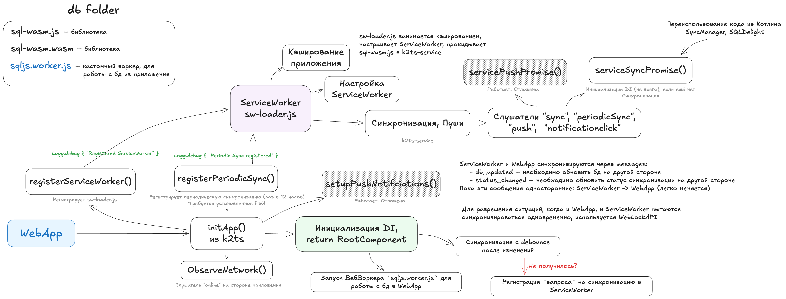

# Взаимодействие WebApp и Service Worker

Данный документ описывает механизмы синхронизации и кэширования данных, кэширования приложения (PWA)

[//]: # (Стек: Kotlin Multiplatform и SQLite &#40;SQLDelight со стороны Котлина&#41; – позволяет переиспользовать код в ServiceWorker)

## 1. Инициализация и регистрация (Startup Flow // k2ts)

**`initApp()` (k2ts) – точка входа в приложение. Выполняет следующие шаги:**

- Регистрация SW: Вызывает `registerServiceWorker()`, который загружает `sw-loader.js`.
- `registerPeriodicSync()`: Регистрирует задачу в браузере, которая будет будить Service Worker каждые 12 часов для
  фонового обновления данных.
- Инициализация Koin (Dependency Injection).
    - При инициализации SQLDriver для работы с бд, запускается `sqljs.worker.js`. (WebApp)
- Слушатель сети: Запускает `observeNetwork()` для подписки на состояние сети "на лету".
- Синхронизация: При запуске пытаемся актуализировать данные.
- Возвращает `RootComponent`

## 2. База данных

Используется библиотека sql.js. Бинарные файлы (.js и .wasm) лежат в папке /db.

- **WebApp:** Работает через выделенный WebWorker ([`sqljs.worker.js`](../webApp/public/db/sqljs.worker.js)) (тяжелые
  запросы не блокируют UI).
- **Service Worker:** Имеет собственный механизм доступа к БД ([
  `SqlJsServiceWorkerDriver.kt`](../shared/core/src/jsMain/kotlin/core/sqldelight/SqlJsServiceWorkerDriver.kt)) для
  выполнения задач в фоне.

## 3. Фоновые процессы (Service Worker // k2ts-service)

`k2ts-service` в main подписывается на системные события:

- `sync`: Срабатывает сразу, как только восстанавливается интернет / как решит устройство (см. Background Sync API).
- `periodicsync`: Плановая попытка синхронизироваться (если новых данных нет, то такая синхронизация не будет
  произведена -> логика в ф-ии sync).
> `sync` и `periodicsync` вызывают `serviceSyncPromise()`
- `push`: Обработка уведомлений от сервера. Вызывает `servicePushPromise()`.
- `notificationclick`: Управляет фокусом окна при клике на уведомление.

Подробнее про `serviceSyncPromise()`:
- Инициализация облегчённого DI (только то, что необходимо для инициализации: SyncManager, SQLDelight)
> Кстати, SyncManager имеет чуть разные реализации для WebApp и ServiceWorker
- Вызывает `forceSync()`: _НЕ ГОТОВО сейчас_
  - Проверяет наличие локальных изменений. _TODO("Добавить параметр, чтобы игнорировать это")_
  - Запрос в сеть.
  - Обновление БД.

**Коммуникация (Messaging)**\
Обмен статусами между фоном и UI происходит через postMessage:
- `db_updated`: Другая сторона должна перезагрузить данные из БД, так как они изменились в фоне.
- `status_changed`: Обновление состояния синхронизации на другой стороне.
> Пока всё это работает только от ServiceWorker к WebApp (нет необходимости)

**Конфликты и блокировки (WebLock API)**\
Для предотвращения попытки "двойной" синхронизации используются локи:\
Если WebApp синхронизируется, Service Worker отменяет свою попытку.

## 4. Offline-first, Кэширование
Service Worker обеспечивает полную работоспособность приложения без интернета:
- **Кэширование**: Все ресурсы (wasm, js, assets) кэшируются.
- **Offline Write**: Изменения сохраняются в локальную БД.
- **Retry Logic**: Если синхронизация не удалась (`SyncStatus.Failed`), регистрируется повторный запрос в ServiceWorker для отправки данных, как только сеть станет стабильной.

> [!NOTE]
> - KMP, DI и многомодульность помогают переиспользовать код, использовать те же модели.
> - Используется кастомный логгер с префиксами [App] и [SW] для удобной отладки через DevTools.